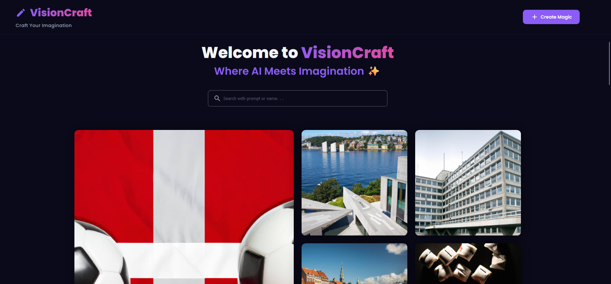

# VisionCraft - AI Image Generation

## 🌟 Overview

VisionCraft is a powerful AI-powered image generation platform that transforms your textual descriptions into stunning visual artwork. Built with React.js and Node.js, it leverages OpenAI's DALL-E API to create unique images from user prompts.
 
<a href="https://frontend-vision-craft-ai-image-generator-qawin.vercel.app" target="blank" align="center"> Live Preview </a><br><br>
<a href="https://frontend-vision-craft-ai-image-generator-qawin.vercel.app" target="blank" align="center">
  <picture>
    <source media="(prefers-color-scheme: dark)" srcset="readme.png">
    
  </picture>
</a>

## ✨ Features

- 🎨 AI-powered image generation
- 💡 Intuitive prompt interface
- 🖼️ Community gallery showcase
- 🔍 Search functionality
- 📱 Responsive design
  

## 🚀 Tech Stack

- **Frontend:**
  - React.js
  - Material-UI
  - Axios

- **Backend:**
  - Node.js
  - Express
  - MongoDB
  - OpenAI API

## 🛠️ Installation

1. Clone the repository:
```bash
(https://github.com/jkalbasri/backend--visionCraft-ai-image-generator-qawin.git)
cd visioncraft
```

2. Install dependencies:
```bash
# Install frontend dependencies
cd client
npm install

# Install backend dependencies
cd ../server
npm install
```

3. Set up environment variables:
```bash
# In server/.env
MONGODB_URL="Your MongoDB Connection String"
OPENAI_API_KEY="Your OpenAI API Key"
CLOUDINARY_CLOUD_NAME="Your Cloudinary Cloud Name"
CLOUDINARY_API_KEY="Your Cloudinary API Key"
CLOUDINARY_API_SECRET="Your Cloudinary API Secret"
PORT=5000
```

4. Start the development servers:
```bash
# Start backend server
cd server
npm start

# Start frontend server
cd client
npm start
```

## 💡 Usage

1. Navigate to `http://localhost:3000`
2. Enter your name and image prompt
3. Click "Generate Image" to create AI artwork
4. Share your creation with the community

## 📁 Project Structure

```
visioncraft/
├── client/                 # Frontend React application
│   ├── src/
│   │   ├── components/    # Reusable UI components
│   │   ├── pages/        # Page components
│   │   ├── api/          # API integration
│   │   └── utils/        # Utility functions
│   └── public/           # Static assets
└── server/               # Backend Node.js application
    ├── controllers/      # Request handlers
    ├── models/          # Database models
    └── routes/          # API routes
```

## 🙏 Acknowledgments

- OpenAI for the DALL-E API
- React.js community
- Material-UI team
- All contributors

---

AA

